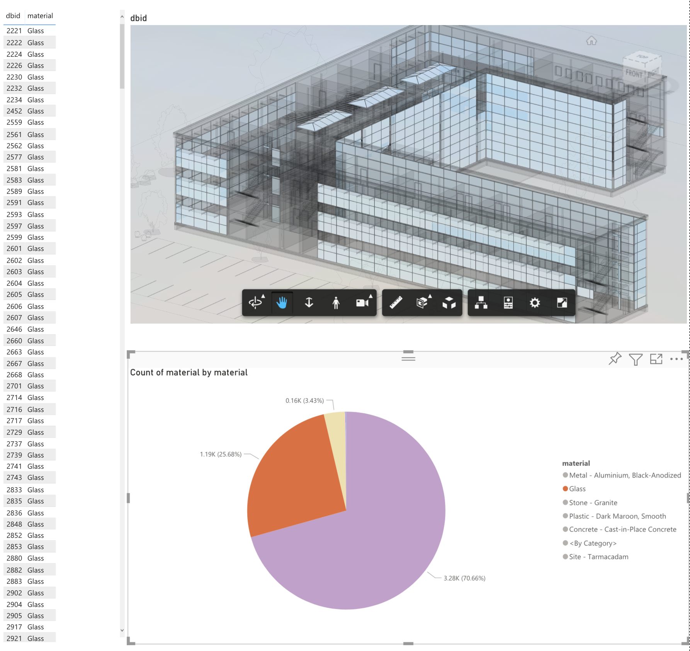
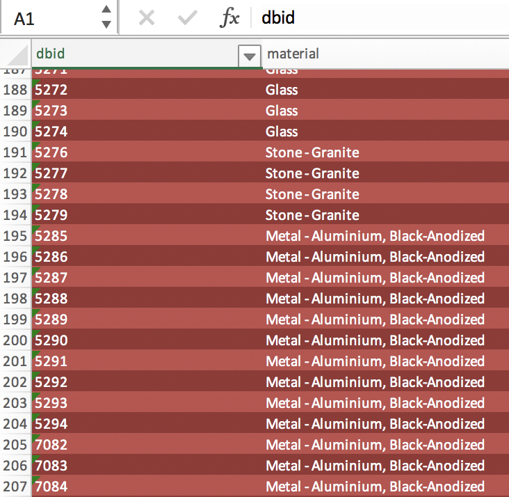
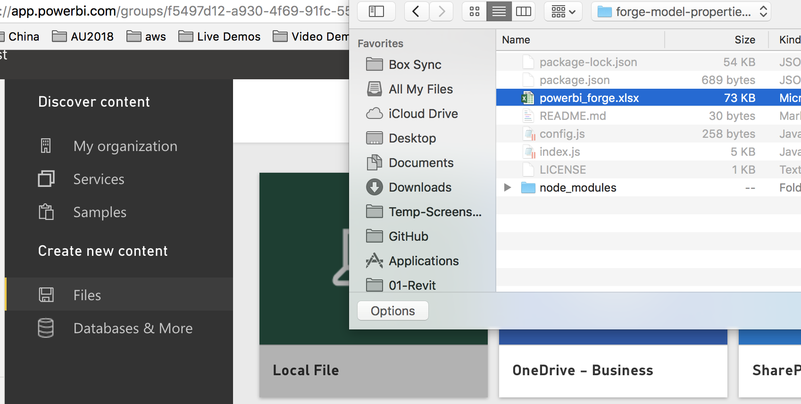
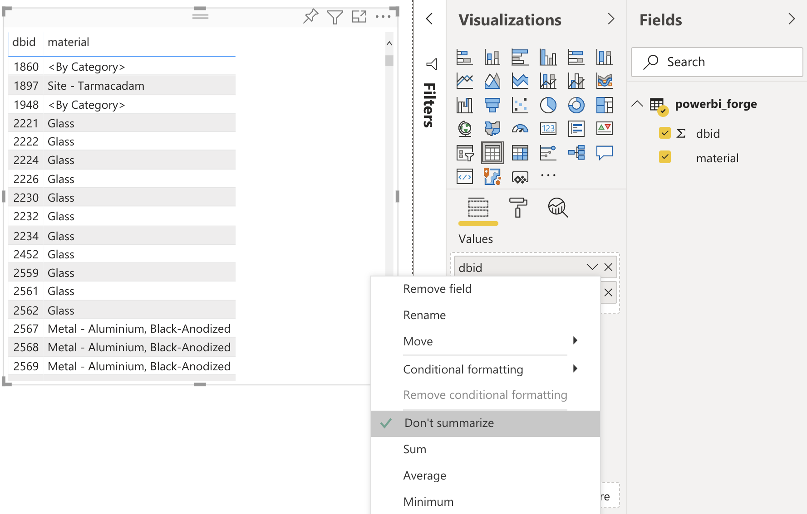
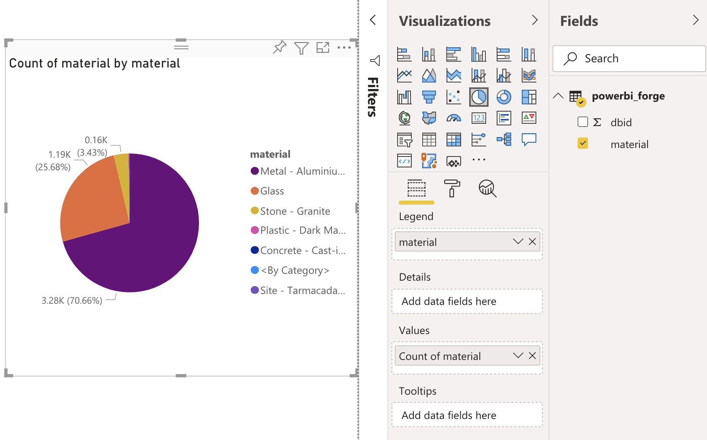
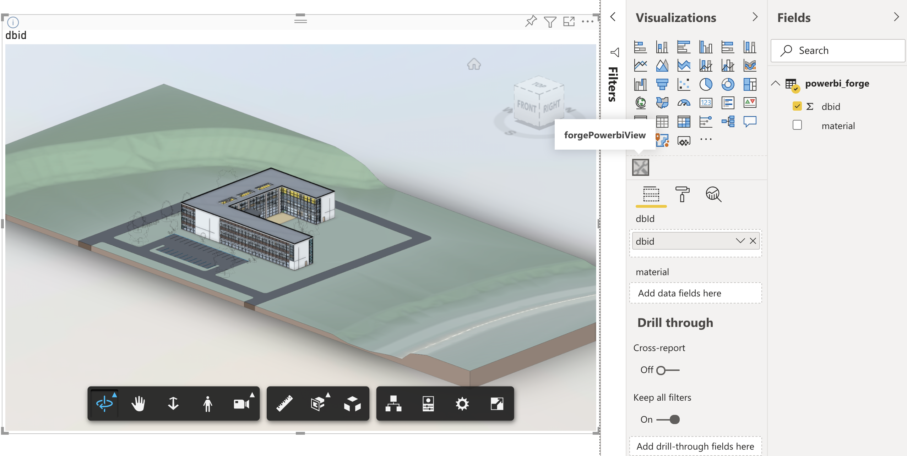
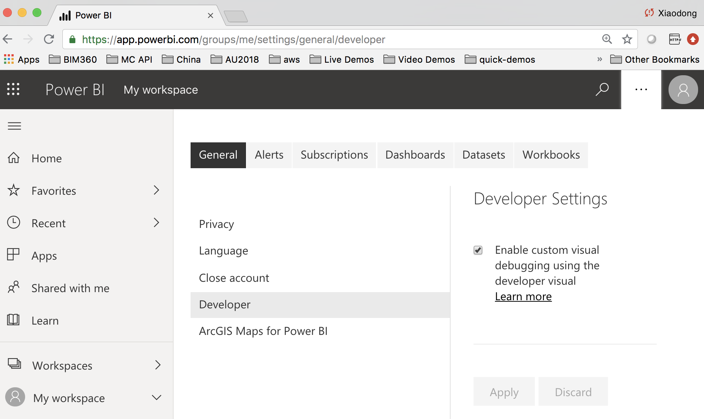
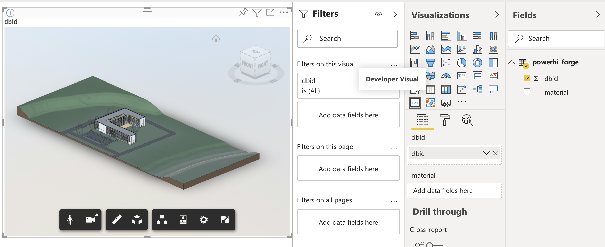

# Forge Viewer Embed in Power BI Report


[](https://nodejs.org)
[](https://www.npmjs.com/)
[](https://code.visualstudio.com)

[](https://www.npmjs.com/package/powerbi-visuals-tools)

[](https://forge.autodesk.com/en/docs/oauth/v2/overview/)
[](https://forge.autodesk.com/en/docs/data/v2/developers_guide/overview/)
[](https://forge.autodesk.com/en/docs/viewer/v7/developers_guide/overview/)


[](http://opensource.org/licenses/MIT)
[](http://developer.autodesk.com/)

## Description

This repository demonstrates how to embed Forge Viewer inside Power BI report by [custom visual](https://powerbi.microsoft.com/en-us/developers/custom-visualization/)


## Thumbnail

<p align="center"></p>


### Steps of exporting model properties to excel file

1. **Forge Account**: Learn how to create a Forge Account, activate subscription and create an app at [this tutorial](http://learnforge.autodesk.io/#/account/). Get _Forge client id_, _Forge client secret_.
2.	Prepare a source model and translate with Forge web services by other Forge Viewer samples. Verify it can be loaded in a general web app successfully. Make a note with its URN.
3.	Switch to the project [forge-model-properties-excel](./forge-model-properties-excel).  Install the packages
4.	Input Forge client id, client secret, Forge bucket key, model urn in the environment or [config file](./forge-model-properties-excel/config.js).
5. In line 55 of [index.js](./forge-model-properties-excel/index.js), ensure which properties you want to extract. The default are dbid and material. You may check the correct property name of your model firstly.
6.	Run the script (or start debugging)
```Node index.js```
7.	After a while, one excel file will be available in the root folder of the project. The time depends on the size of the model properties json. If large file, it may take more time.
 <p align="center"></p>   

8. In [Power BI app](https://app.powerbi.com), import the excel file as data source.
 <p align="center"></p>   

9. Create report from the data source. Insert one table view, selecting dbid and material from field view. Note: please switch dbid type to **Don't Summarize**
 <p align="center"></p>   

10. Insert one pie chart, selecting material as Legend and material count as Values.
 <p align="center"></p>   


### Steps of building custom visual of Power BI

1.	Follow the steps to [setup environment of PowerBI custom visual](https://powerbi.microsoft.com/en-us/developers/custom-visualization/). Note: install ***pbiviz 2.5.0***.

        ```npm i -g powerbi-visuals-tools@2.5.0```

2.	Follow [the tutorial](https://powerbi.microsoft.com/en-us/developers/custom-visualization/) to create a new project of custom visual and test/debug it in PowerBI. 

3.	Switch to the project [forgePowerbiView](./forgePowerbiView). Install the packages.

4. Two more functions are not defined in the latest version of @types/forge-viewer.  Manually append them in the code below. you can  replace the default ts file by [upated-forge-viewer-index.d.ts](./upated-forge-viewer-index.d.ts)
        ```node_modules/@types/forge-viewer/index.d.ts```

4.	Prepare 2legged token for loading model in Forge Viewer
    a.	Manually generate a token. Input token and URN to the file 
    b.	OR, prepare a custom endpoint on your server for generating token on demand. Please enable ***Access-Control-Allow-Origin*** .The code below is a demo in my local server, which is based on the sample of [LearnForge tutorial](https://github.com/Autodesk-Forge/learn.forge.viewmodels/tree/nodejs)

    ```
    // GET /api/forge/oauth/token - generates a public access token (required by the Forge viewer).
    router.get('/token', async (req, res, next) => {

        res.header("Access-Control-Allow-Origin", "*"); // update to match the domain you will make the request from
        res.header("Access-Control-Allow-Headers", "Origin, X-Requested-With, Content-Type, Accept");

        try {
            const token = await getPublicToken();
            res.json({
                access_token: token.access_token,
                expires_in: token.expires_in    
            });
        } catch(err) {
            next(err);
        }
    });
    ```

5.	build the project by the script below
    ```
     pbiviz package
    ```

The distributed file ***PowerBI_ForgeViewer_Visual.pbiviz** will be generated at [dist folder](./forgePowerbiView/dist). Load the visual package in Power BI visuals box. Insert one instance, select dbid from fields. It will take some time for the custom visual to load the model in Viewer.

 <p align="center"></p>   


6.	 Run the script below will start debug mode. Ensure the developer model is enabled with  your PowerBI account. Insert an instance of developer visual.  Select dbid from fields.. Similarly it will take some time for the custom visual to load the model in Viewer.
 ```
     pbiviz start
```

 <p align="center"></p>   

 <p align="center"></p>   

7.	Insert a table visual, selecting all columns of the data.
8.	Insert an instance of Pie Visual, selecting Material as , and Material count as value. 
9.	Click one row of table view, the corresponding single objects in Forge Viewer will be isolated. Select a material in pie view, the corresponding group of objects in Forge Viewer will be isolated.
<p align="center"></p>
10. Open browser >> developer console when you want to debug in code.